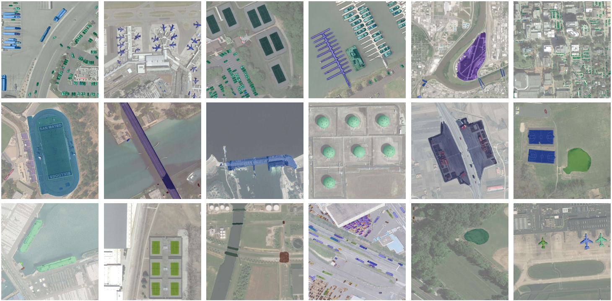

<h1 align="center"> Scaling-up Remote Sensing Segmentation Dataset with Segment Anything Model </h1>
<p align="center">
<a href="https://arxiv.org/abs/2305.02034">"></a>
</p>
<h5 align="center"><em>Di Wang, Jing Zhang, Bo Du, Dacheng Tao, Liangpei Zhang</em></h5>
<p align="center">
  <a href="#news">News</a> |
  <a href="#introduction">Abstract</a> |
  <a href="#usage">Usage</a> |
  <a href="#results">Results</a> |
  <a href="#statement">Statement</a>
</p>


# News

**2023.09.22**

- The codes of generating SAMRS dataset are released!

**2023.09.22**

- The paper is accepted by NeurIPS 2023 Datasets and Benchmarks Track!

**2023.08.30**

- The SAMRS images are released! See in [[Dataset](https://1drv.ms/f/s!AimBgYV7JjTlgckJ0Xip2yD0y9HD_Q?e=8hm8xa)]

**2023.06.14**

- The semantic labels are released! See in [[Dataset](https://1drv.ms/f/s!AimBgYV7JjTlgckJ0Xip2yD0y9HD_Q?e=8hm8xa)]

**2023.05.04**

- The tech report is post on arxiv! Work in progress.


> Other applications of [ViTAE](https://github.com/ViTAE-Transformer/ViTAE-Transformer) inlcude: [VSA](https://github.com/ViTAE-Transformer/ViTAE-VSA) | [ViTPose](https://github.com/ViTAE-Transformer/ViTPose) | [Matting](https://github.com/ViTAE-Transformer/ViTAE-Transformer-Matting) | [Scene Text Spotting](https://github.com/ViTAE-Transformer/ViTAE-Transformer-Scene-Text-Detection)  | [Video Object Segmentation](https://github.com/ViTAE-Transformer/VOS-LLB)

# Introduction

This is the official repository of the paper <a href="https://arxiv.org/abs/2305.02034"> Scaling-up Remote Sensing Segmentation Dataset with Segment Anything Model </a>

<figure>

<figcaption align = "center"><b>Figure 1: Some examples of SAM segmentation results on remote sensing images. 
 </b></figcaption>
</figure>

<p>

<p align="left"> In this study, we leverage <a href="https://arxiv.org/abs/2304.02643"> SAM </a> and existing RS object detection datasets to develop an efficient pipeline for generating a large-scale RS segmentation dataset, dubbed SAMRS. SAMRS surpasses existing high-resolution RS segmentation datasets in size by several orders of magnitude, and provides object category, location, and instance information that can be used for semantic segmentation, instance segmentation, and object detection, either individually or in combination. We also provide a comprehensive analysis of SAMRS from various aspects. We hope it could facilitate research in RS segmentation, particularly in large model pre-training.


# Usage
The code and dataset will be released soon.


# Results
## The basic information of generated datasets

<figure>

<figcaption align = "center"><b>Figure 2: Comparisons of different high-resolution RS segmentation datasets. 
 </b></figcaption>
</figure>

<p>

We present the comparison of our SAMRS dataset with existing high-resolution RS segmentation datasets in table. Based on the available high-resolution RSI object detection datasets, we can efficiently annotate 10,5090 images, which is more than ten times the capacity of existing datasets. Additionally, SAMRS inherits the categories of the original detection datasets, which makes them more diverse than other high-resolution RS segmentation collections. It is worth noting that RS object datasets usually have more diverse categories than RS segmentation datasets due to the difficulty of tagging pixels in RSIs, and thus our SAMRS reduces this gap. 


## Visualization of Generated Masks


<figure>

<figcaption align = "center"><b>Figure 3: Some visual examples from the three subsets of our SAMRS dataset.  
 </b></figcaption>
</figure>

<p>

In figure, we visualize some segmentation annotations from the three subsets in our SAMRS dataset. As can be seen, SOTA exhibits a greater number of instances for tiny cars, whereas FAST provides a more fine-grained annotation of existing categories in SOTA such as car, ship, and plane. SIOR on the other hand, offers annotations for more diverse ground objects, such as *dam*. Hence, our SAMRS dataset encompasses a wide range of categories with varying sizes and distributions, thereby presenting a new challenge for RS semantic segmentation.


## Dataset Statistics and Analysis
### The class distribution.

<figure>

<figcaption align = "center"><b>Figure 4: Statistics of the number of pixels and instances for each category in the SAMRS database. The histograms for the subsets SOTA, SIOR, and FAST are shown in the first, second, and third columns, respectively. The first row presents histograms on a per-pixel basis, while the second row presents histograms on a per-instance basis.</a>  
 </b></figcaption>
</figure>


### The mask size distribution.

<figure>

<figcaption align = "center"><b>Figure 5: Statistics of the mask sizes in different subsets of the SAMRS database. (a) SOTA. (b) SIOR. (c) FAST.</a>  
 </b></figcaption>
</figure>


# Statement

This project is for research purpose only. For any other questions please contact [d_wang@whu.edu.cn](mailto:d_wang@whu.edu.cn).


## Citation

If you find SAMRS helpful, please consider giving this repo a star:star: and citing:

```
@inproceedings{SAMRS,
  title={Scaling-up Remote Sensing Segmentation Dataset with Segment Anything Model},
  author={Di Wang, Jing Zhang, Bo Du, Dacheng Tao, Liangpei Zhang},
  booktitle={arxiv},
  year={arXiv preprint arXiv:2305.02034}
}
```

## Relevant Projects

[1] <strong>An Empirical Study of Remote Sensing Pretraining, IEEE TGRS, 2022</strong> | [Paper](https://ieeexplore.ieee.org/document/9782149) | [Github](https://github.com/ViTAE-Transformer/RSP)
<br><em>&ensp; &ensp; &ensp;Di Wang<sup>&#8727;</sup>, Jing Zhang<sup>&#8727;</sup>, Bo Du, Gui-Song Xia and Dacheng Tao</em>

[2] <strong>Advancing Plain Vision Transformer Towards Remote Sensing Foundation Model, IEEE TGRS, 2022</strong> | [Paper](https://ieeexplore.ieee.org/document/9956816/) | [Github](https://github.com/ViTAE-Transformer/Remote-Sensing-RVSA)
<br><em>&ensp; &ensp; &ensp;Di Wang<sup>&#8727;</sup>, Qiming Zhang<sup>&#8727;</sup>, Yufei Xu<sup>&#8727;</sup>, Jing Zhang, Bo Du, Dacheng Tao and Liangpei Zhang</em>

